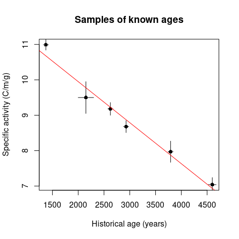

<!-- README.md is generated from README.Rmd. Please edit that file -->

# folio 

<!-- badges: start -->

[](https://github.com/tesselle/folio/actions)

[](https://tesselle.r-universe.dev)
[](https://cran.r-project.org/package=folio)
[](https://cran.r-project.org/web/checks/check_results_folio.html)
[](https://cran.r-project.org/package=folio)

[](https://www.repostatus.org/#active)

[](https://doi.org/10.5281/zenodo.4476182)
<!-- badges: end -->

Datasets for teaching quantitative approaches and modeling in
archaeology and paleontology. This package provides several types of
data related to broad topics (cultural evolution, radiocarbon dating,
paleoenvironments, etc.), which can be used to illustrate statistical
methods in the classroom (multivariate data analysis, compositional data
analysis, diversity measurement, etc.).

This package is for teaching purposes only: some datasets may be
outdated.

When using **folio**, you must cite the relevant publications for each
dataset (see the documentation).

## Installation

You can install the released version of **folio** from
[CRAN](https://CRAN.R-project.org) with:

``` r
install.packages("folio")
```

And the development version from [GitHub](https://github.com/) with:

``` r
# install.packages("remotes")
remotes::install_github("tesselle/folio")
```

## Usage

``` r
## Arnold and Libby's Curve of Knowns
## Replicate fig. 1 from Arnold and Libby (1949)
data("arnold1949")

fit <- lm(activity_found ~ age_expected, data = arnold1949)
summary(fit)
#> 
#> Call:
#> lm(formula = activity_found ~ age_expected, data = arnold1949)
#> 
#> Residuals:
#>        1        2        3        4        5        6 
#>  0.31341 -0.27618 -0.04573 -0.19344  0.09780  0.10414 
#> 
#> Coefficients:
#>                Estimate Std. Error t value Pr(>|t|)    
#> (Intercept)  12.2665215  0.2903726   42.24 1.88e-06 ***
#> age_expected -0.0011588  0.0000938  -12.35 0.000247 ***
#> ---
#> Signif. codes:  0 '***' 0.001 '**' 0.01 '*' 0.05 '.' 0.1 ' ' 1
#> 
#> Residual standard error: 0.2421 on 4 degrees of freedom
#> Multiple R-squared:  0.9745, Adjusted R-squared:  0.9681 
#> F-statistic: 152.6 on 1 and 4 DF,  p-value: 0.0002467

plot(
  x = arnold1949$age_expected,
  y = arnold1949$activity_found,
  type = "p",
  pch = 16,
  xlab = "Historical age (years)",
  ylab = "Specific activity (C/m/g)",
  main = "Samples of known ages"
)
segments(
  x0 = arnold1949$age_expected,
  y0 = arnold1949$activity_found - arnold1949$activity_found_error,
  x1 = arnold1949$age_expected,
  y1 = arnold1949$activity_found + arnold1949$activity_found_error
)
segments(
  x0 = arnold1949$age_expected - arnold1949$age_expected_error,
  y0 = arnold1949$activity_found,
  x1 = arnold1949$age_expected + arnold1949$age_expected_error,
  y1 = arnold1949$activity_found
)
abline(fit, col = "red")
```

<!-- -->

## Contributing

Please note that the **folio** project is released with a [Contributor
Code of Conduct](https://www.tesselle.org/conduct.html). By contributing
to this project, you agree to abide by its terms.
